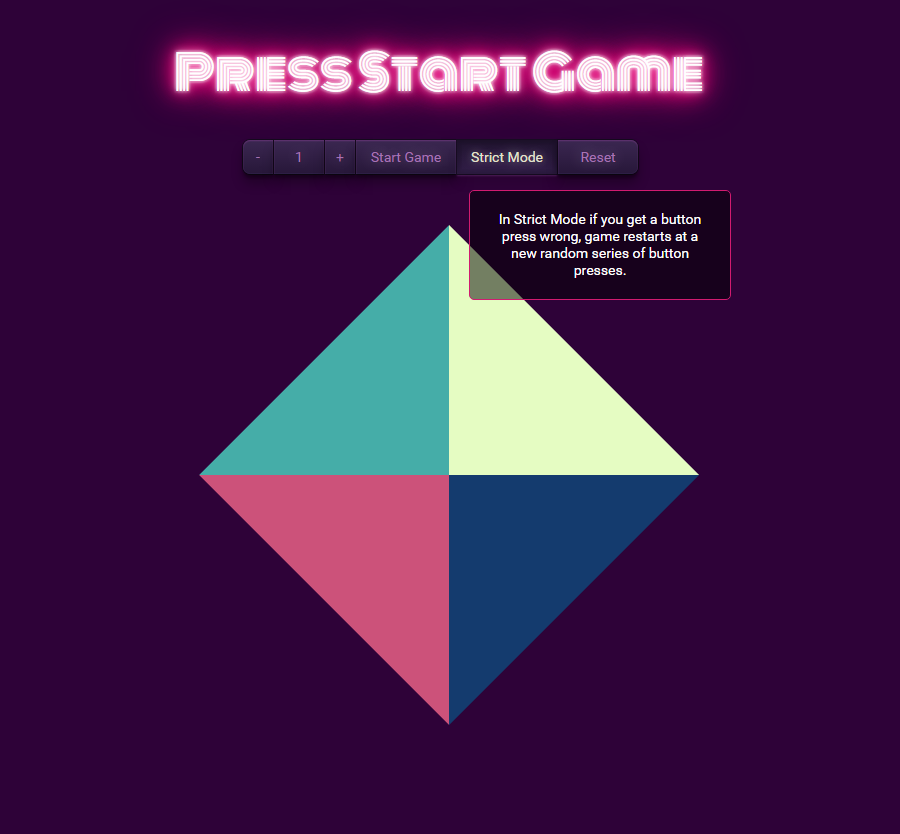
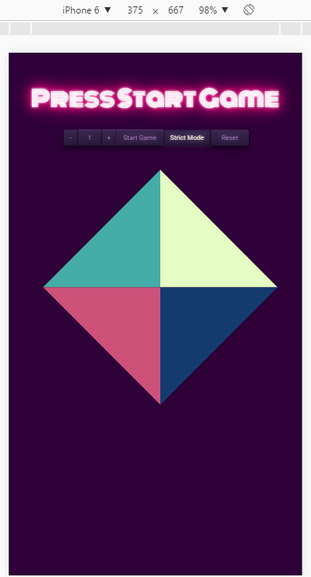

# simon game
#### [live demo](http://prochal.com/simongame/)
Simon game is a game where a player has to follow a provided sound/color pattern in order to win. The UI consists of navigation bar, where you can set initial moves, at which you'll like to begin a self explanaiable start button and a strict mode toggle. In strict mode when you press a wrong key, game restarts at level 0, when turned off you have a chance to repeat current level.

After a peer review I adjusted objects in the project and used more sophisticated notation (as for beginner :) and redesign template to mobile responsive form.

I took 80's retro posters and sounds for visual side inspiration.

